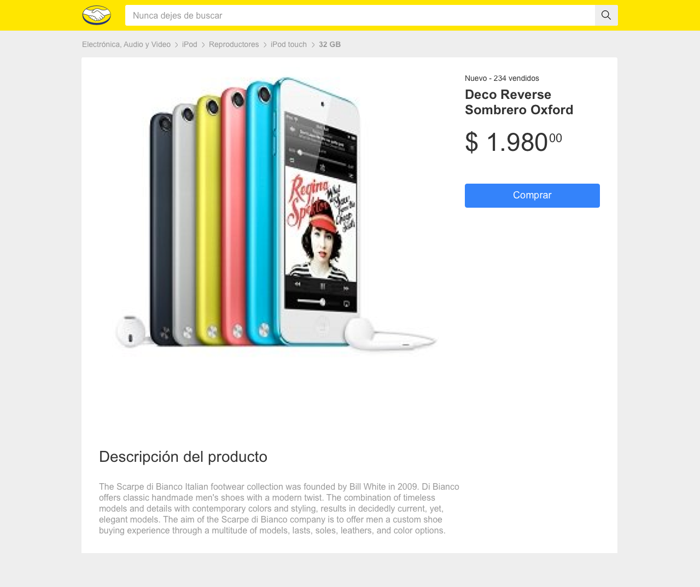

# Test práctico Front-end -- Alejandro Nava
Test práctico para aspirantes al área de front-end de Mercado Libre.

A continuación presentamos el diseño y la descripción funcional de una pequeña aplicación que será la base del trabajo que deberás desarrollar.

La aplicación consta de tres componentes principales: la caja de búsqueda, la visualización de resultados, y la descripción del detalle del producto.
<div>
<p> 1. Caja de búsqueda </p>
  
<p> 2. Resultado de la búsqueda</p>  
   
<p> 3. Detalle del producto </p>
  
</div>

### Te pedimos
  - En base a los diseños dados, construir las siguientes tres vistas:
    - Caja de búsqueda
    - Resultados de la búsqueda
    - Detalle del producto
  - Las vistas son navegables de manera independiente y cuentan con su propia url:
    - Caja de Búsqueda: “/”
    - Resultados de la búsqueda:“/items?search=”
    - Detalle del producto: “/items/:id”
  - Construir los siguientes endpoints para ser utilizados desde las vistas:
    - /api/items?q=:query
    
      Estructura:

            {
              "author": {
                "name": String,
                "lastname": String 
              },
              "categories": [String, String, String], 
              "items": [
                {
                  "id": String,
                  "title": String,
                  "price": {
                    "currency": String,
                    "amount": Number,
                    "decimals": Number
                  },
                  "picture": String,
                  "condition": String,
                  "free_shipping": Boolean
              }]
            }
    - /api/items/:id

      Estructura:
        
          {
            "author": {
              "name": String,
              "lastname": String 
            },
            "item":
              {
                "id": String,
                "title": String,
                "price": {
                  "currency": String,
                  "amount": Number,
                  "decimals": Number
                },
                "picture": String,
                "condition": String,
                "free_shipping": Boolean,
                "sold_quantity": Number,
                "description": String,
                "category": [String]        
            }
          }

### Descripción funcional de la aplicación

- En la vista de caja de búsqueda, debería poder ingresar el producto a buscar y al enviar el formulario navegar a la vista de Resultados de búsqueda, visualizando solo 4 productos. Luego, al hacer clic sobre uno de ellos, debería navegar a la vista de Detalle de Producto.
- Dado un id de producto, debería poder ingresar directamente a la vista de detalle de producto.

## Desarrollo 🛠️

Instrucciones para poder instalar y ejecutar el test práctico para aspirantes 
al área de front-end de Mercado Libre.

Cada proyecto tiene su README más específico en la raiz de su carpeta.

Aquí se encuentran las consideraciones e instrucciones generales.

##  Requerimientos 📝
  - Node >= 14.20.1
  - Npm >= 6.14.17

## Estructura del proyecto 
``` sh
├───client/                                           ------> Front-end
│   ├───public/
│   │   ├───favicon.ico
│   │   ├───index.html
│   │   ├───manifest.json
│   │   └───robots.txt
│   ├───src/
│   │   ├───assets/
│   │   │   ├───icons/
│   │   │   │   ├───ic_Search.png
│   │   │   │   ├───ic_Search@2x.png.png.png
│   │   │   │   ├───ic_shipping.png
│   │   │   │   └───ic_shipping@2x.png.png.png
│   │   │   └───images/
│   │   │       ├───Logo_ML.png
│   │   │       └───Logo_ML@2x.png.png.png
│   │   ├───components/
│   │   │   ├───Breadcrumbs.tsx
│   │   │   ├───Buttom.tsx
│   │   │   ├───CardItem.tsx
│   │   │   ├───Description.tsx
│   │   │   └───Header.tsx
│   │   ├───pages/
│   │   │   ├───DescriptionItem.tsx
│   │   │   ├───Home.tsx
│   │   │   └───Results.tsx
│   │   ├───routes/
│   │   │   └───routes.tsx
│   │   ├───styles/
│   │   │   ├───base/
│   │   │   │   └───_global.scss
│   │   │   ├───components/
│   │   │   │   ├───_breadcrumb.scss
│   │   │   │   ├───_button.scss
│   │   │   │   ├───_carditem.scss
│   │   │   │   ├───_description.scss
│   │   │   │   ├───_header.scss
│   │   │   │   └───_results.scss
│   │   │   └───index.scss
│   │   ├───utils/
│   │   │   └───formatPrice.ts
│   │   ├───App.test.tsx
│   │   ├───App.tsx
│   │   ├───index.tsx
│   │   ├───logo.svg
│   │   ├───reportWebVitals.ts
│   │   └───setupTests.ts
│   ├───README.md
│   ├───package-lock.json
│   ├───package.json
│   └───tsconfig.json
├───images/                                       
│   ├───01_Buscador.png
│   ├───02_Detalle.png
│   ├───02_Resultados.png
│   ├───api-detalle.png
│   ├───api-resultados.png
│   ├───detalle.png
│   ├───home.png
│   └───resultados.png
├───server/                                         ------> Servidor APIs
│   ├───src/
│   │   ├───models/
│   │   │   ├───item.ts
│   │   │   └───search.ts
│   │   ├───routes/
│   │   │   ├───itemDescription.ts
│   │   │   └───search.ts
│   │   ├───utils/
│   │   │   └───formatPrice.ts
│   │   └───index.ts
│   ├───README.md
│   ├───package-lock.json
│   └───package.json
└───README.md
```

## Servidor 🔗
  Navegar dentro de la carpeta `server` con el comando
  `cd server/`

  ## Instalación 🚧
  Instalamos las dependencias necesarias ejecutando el comando 
  `npm install`

  ## Ejecución 🚀
  Para poder iniciar nuestro servidor ejecutamos el comando `npm run dev`
  nos devolvera un mensaje en consola  similar a este `Server running at 8000` 
  esto nos informa que ya se encuentra activo, de igual manera lo podemos 
  visualizar en http://localhost:8000


## Cliente 🔗
  Navegar dentro de la carpeta `client` con el comando
  `cd client/`

  ## Instalación 🚧
  Instalamos las dependencias necesarias ejecutando el comando 
  `npm install`

  ## Ejecución 🚀
  Para poder ejecutar nuestro cliente ejecutamos el comando `npm start`
  Lo podemos visualizar en http://localhost:3000
