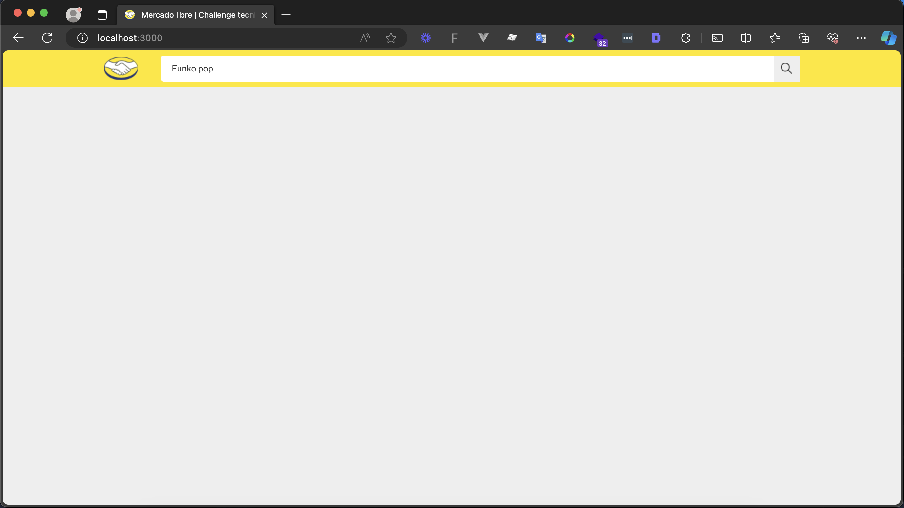
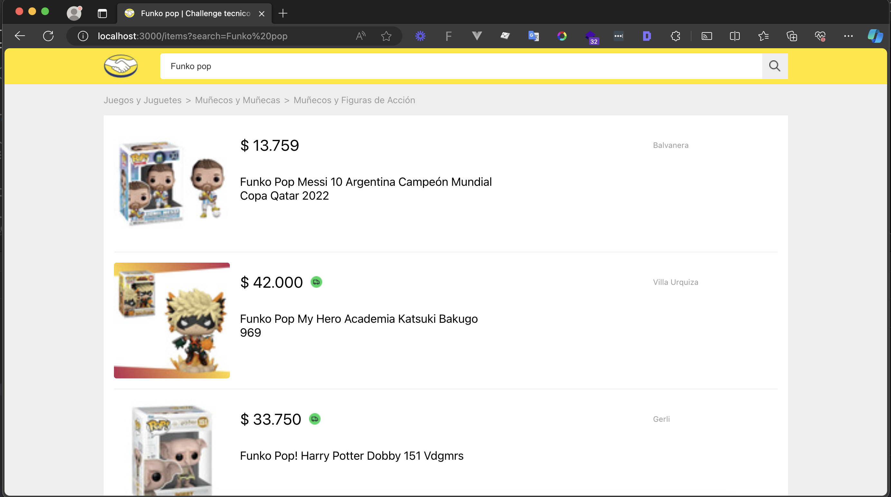
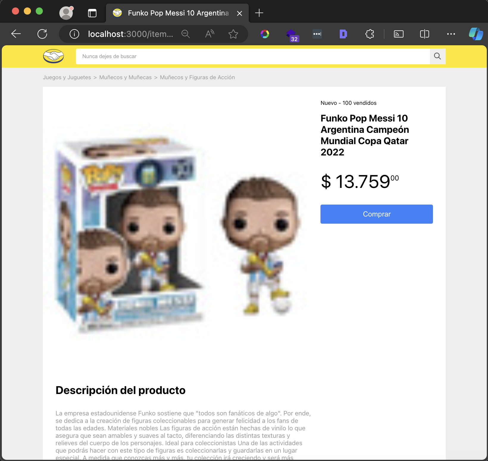

#  Test práctico cliente -- Alejandro Nava
  Aplicación de búsqueda de productos y detalle de los mismos.

## Tecnologías ⚙️
  - React
  - TypeScript
  - Sass

## Requerimientos 📝
  - Node >= 14.20.1
  - Npm >= 6.14.17

## Instalación 🚧
  Instalamos las dependencias necesarias ejecutando el comando 
  `npm install`

## Ejecucion 🚀
  Para poder iniciar nuestro cliente, ejecutamos el comando `npm start`
  y lo podemos visualizar en http://localhost:3000

## Consideraciones ⚠️
  Si se llega a cambiar el puerto en el cual se ejecuta el servidor, se debe actualizar
  el proxy en el `package.json` para que pueda tener comunicación con el cliente.

## Funcionalidad  ✨
  La aplicación cuenta con 3 vistas:

  ### Home 🔗 http://localhost:3000/
  Aquí es donde podemos comenzar a buscar algun producto desde el `search_box` del header

  

  ### Resultados 🔗 http://localhost:3000/items?search=
  Nos muestra la lista de resultados encontrados, podemos dar click a cualquiera de ellos
    y nos mandará al detalle del producto.

  

  ### Detalle del producto 🔗 http://localhost:3000/items/:id
  Podemos ingresar directamente un ID o llegar por la vista de resultados.
    Aquí nos muestra el detalle del producto solicitado.

  
