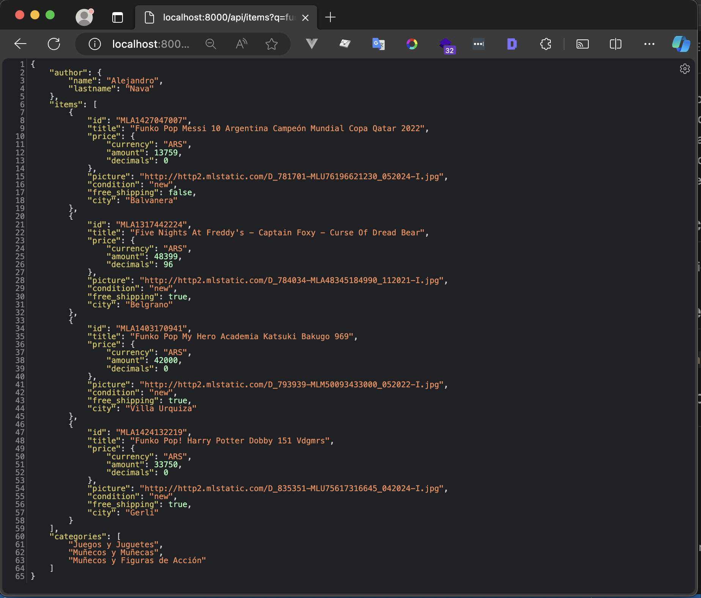
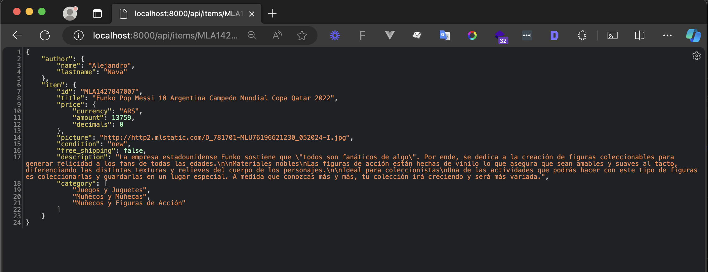

# Test práctico server -- Alejandro Nava
  Servidor de APIs para la búsqueda de productos y detalle de los mismos.

## Tecnologías ⚙️
  - Express
  - TypeScript

## Requerimientos 📝
  - Node >= 14.20.1
  - Npm >= 6.14.17

## Instalación 🚧
Instalamos las dependencias necesarias ejecutando el comando 
`npm install`

## Ejecucion 🚀
  Para poder iniciar nuestro servidor, ejecutamos el comando `npm run dev`
  nos devolvera un mensaje en consola  similar a este `Server running at 8000` 
  esto nos informa que ya se encuentra activo, de igual manera lo podemos 
  visualizar en http://localhost:8000

## Funcionalidad  ✨
  El servidor contiene las siguientes APIs

  #### API = `/api/items?q=:query`
  #### METHOD `GET`
  #### RESPONSE

  

  #### API `/api/items/:id`
  #### METHOD `Get`
  #### RESPONSE

  
